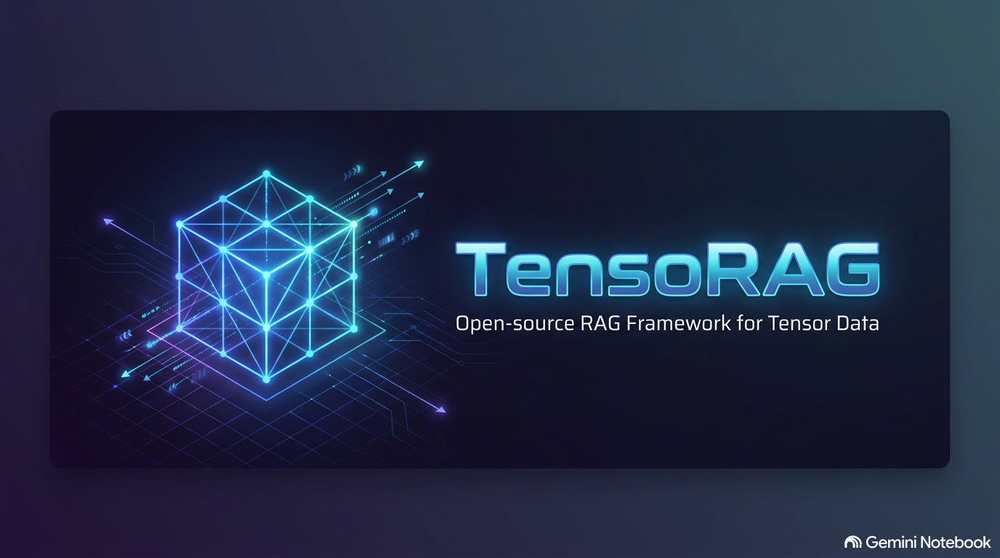

# TensoRAG: Multilinear Generalized Singular Value Decomposition (ML-GSVD)

<p align="center">
  
</p>

A high-performance Python/NumPy implementation of the **Multilinear Generalized Singular Value Decomposition (ML-GSVD)**, based on the pioneering mathematical research of **Dr. Liana Khamidullina** and **Prof. Martin Haardt** (Technische Universität Ilmenau).

[](LICENSE)
[](https://www.python.org/)
[](https://tensorag.streamlit.app/)

> ⚠️ **Disclaimer:** This is an independent, private hobby project developed by @Forstwichtel. It is not officially affiliated with, endorsed by, or in any way connected to the authors or the Technische Universität Ilmenau. This repository serves solely as an independent implementation of their published academic findings.

---

## 👥 Authors & Contributors

*   **Main Author:** Forstwichtel (Pseudonym)
*   **Co-Author:** Gemini Notebook [bot]

---

## 📌 Introduction & Mathematical Background

**TensoRAG** implements the **ML-GSVD**, a major mathematical breakthrough that extends the classical 2-matrix Generalized SVD (GSVD) to an arbitrary number of $K \ge 2$ matrices (viewed as slices of a 3D tensor $\mathcal{H}$) sharing a common dimension. 

Unlike prior attempts (such as the HO-GSVD), the ML-GSVD strictly preserves the core properties of the GSVD, specifically the **exact column-orthogonality** of the left factor matrices $\mathbf{B}_k$.

Mathematically, it decomposes a set of $K$ matrices $\mathbf{H}_k \in \mathbb{C}^{J_k \times I}$ simultaneously into:
$$\mathbf{H}_k \approx \mathbf{B}_k \cdot \mathbf{C}_k \cdot \mathbf{A}^H \quad \text{for } k = 1, \dots, K$$

*   **$\mathbf{A}^H \in \mathbb{C}^{Q \times I}$**: The **Shared Representation Basis** (the "core matrix" representing the global common subspace).
*   **$\mathbf{B}_k \in \mathbb{C}^{J_k \times Q}$**: The **Left Orthogonal Factors** ($\mathbf{B}_k^H \mathbf{B}_k = \mathbf{I}$), keeping the geometric structures intact.
*   **$\mathbf{C}_k \in \mathbb{R}^{Q \times Q}$**: The **Coefficient Matrices** (real, non-negative diagonal matrices representing the singular values for each specific slice).

---

## 🚀 Key Features

*   **Simultaneous Multi-Matrix Factorization:** Jointly decomposes $K \ge 2$ matrices with different row dimensions but a shared column dimension.
*   **True Orthogonal Procrustes Solver:** Solves the orthogonal factor updates via stable polar decomposition (using SVD) to guarantee strict column-orthogonality down to machine precision ($\sim 10^{-15}$ / standard float64 limits).
*   **Alternating Least Squares (ALS):** Implements the robust *Direct Fitting* iterative optimization algorithm.
*   **Two-Stage Retrieval Engine:** Integrated coarse-to-fine search pattern using fast subspace filtering ($O(N)$ via `np.argpartition`) followed by exact raw-data rescoring.
*   **Complex & Real Support:** Fully compatible with both real-valued data (e.g., neural network weights) and complex-valued data (e.g., wireless signal processing / MIMO channel matrices).
*   **Low-Rank Compression:** Optimal for reducing parameter footprint in deep learning (e.g., compressing Attention layers) and streamlining large-scale Vector Search / RAG databases.

---

## 📂 Repository Structure

```text
├── LICENSE                 # PolyForm NonCommercial 1.0.0 License
├── NOTICE                  # Copyright & academic attribution statements
├── README.md               # English main documentation (this file)
├── README_DE.md            # German documentation
├── tensorag.py             # Production-ready implementation of ML-GSVD class & Two-Stage Search
├── tensorag_demo.py        # Complete RAG simulation demonstrating vector compression
├── tensorag_benchmark.py   # Speed & latency comparison benchmark script
└── tensorag_streamlit_demo.py # Code for interactive Streamlit Web Dashboard
```

---

## 💻 Quick Start & Usage

This library is packaged as a single, lightweight Python module with no external dependencies other than **NumPy**.

```python
import numpy as np
from tensorag import MultilinearGSVD

# 1. Generate synthetic data (e.g., 4 matrix slices sharing a column dimension of 100)
K, I = 4, 100
row_dimensions = [64, 48, 80, 120]  # Rows can vary per slice!
H_list = [np.random.randn(dim, I) for dim in row_dimensions]

# 2. Instantiate and run ML-GSVD to compress to a target subspace rank of Q = 16
Q = 16
gsvd = MultilinearGSVD(target_rank=Q, max_iter=50, tol=1e-6)
gsvd.fit(H_list)

# 3. Access the factors
print("Shared Basis A shape:", gsvd.A.shape)  # Expected: (100, 16)
for k in range(K):
    print(f"Slice {k} - Orthogonal factor B_k shape:", gsvd.B[k].shape)  # e.g., (64, 16)
    print(f"Slice {k} - Coefficients C_k diagonal:", gsvd.C[k, :])

# 4. Reconstruct and measure error
H_0_rec = gsvd.reconstruct(0)
reconstruction_error = np.linalg.norm(H_list[0] - H_0_rec)
print(f"Slice 0 Reconstruction Error: {reconstruction_error:.4f}")
```

---

## 🎯 Two-Stage Retrieval Pattern (Coarse-to-Fine Rescoring)

To eliminate compression-induced recall trade-offs while retaining **up to 91% RAM index savings**, TensoRAG provides a built-in **Two-Stage Search Pipeline**:

1. **Stage 1 (Subspace Coarse Filter):** Projects the high-dimensional query into the $Q$-dimensional shared subspace ($\mathbf{q}_{comp} = \mathbf{q} \cdot \mathbf{A}^*$) and selects the top $N$ candidates (e.g. $N=30$) in $O(N)$ linear time using `np.argpartition`.
2. **Stage 2 (Exact Raw Rescoring):** Computes exact Cosine Similarity for only those 30 pre-selected candidates against uncompressed original vectors.

```python
import numpy as np
from tensorag import MultilinearGSVD

# 1. Fit ML-GSVD model
gsvd = MultilinearGSVD(target_rank=128).fit(H_list)

# 2. Execute Two-Stage Search for a high-dimensional query vector (e.g. 1536-dim)
query_vec = np.random.randn(1536)

final_doc_ids, final_scores = gsvd.two_stage_search(
    k=0,                        # Target database collection index
    query_vector=query_vec,     # Original uncompressed query vector
    raw_vectors_k=H_list[0],   # Uncompressed vectors for stage 2 rescoring
    top_k=5,                    # Desired number of final results
    top_n_candidates=30         # Stage 1 over-fetching candidate count
)

print("Top-5 Document IDs:", final_doc_ids)
print("Top-5 Exact Cosine Scores:", final_scores)
```

---

## 📜 Academic Attribution & Citation

If you use this code or algorithm in your research or applications, please cite the underlying academic publications that made this work possible:

### Primary Thesis
> **Khamidullina, Liana (2024).**  
> *Tensor decompositions and algorithms for efficient multidimensional signal processing.*  
> Dissertation, Technische Universität Ilmenau.  
> URN: [urn:nbn:de:gbv:ilm1-2024000104](https://nbn-resolving.org/urn:nbn:de:gbv:ilm1-2024000104)  
> DOI: [10.22032/dbt.59389](https://doi.org/10.22032/dbt.59389)

### Key Journal Publication
> **L. Khamidullina, A. L. F. de Almeida, and M. Haardt,**  
> "Multilinear Generalized Singular Value Decomposition (ML-GSVD) and Its Application to Multiuser MIMO Systems,"  
> *IEEE Transactions on Signal Processing*, vol. 70, pp. 2783-2797, 2022.  
> DOI: [10.1109/TSP.2022.3178902](https://doi.org/10.1109/TSP.2022.3178902)

---

## ⚖️ License & Commercial Licensing

### Non-Commercial / Academic License
TensoRAG is dual-licensed. This repository is free for **academic research, educational purposes, university projects, non-profit scientific evaluation, and personal non-commercial experimentation** under the [PolyForm NonCommercial License 1.0.0](LICENSE).

### Commercial Licensing & Enterprise Use
Commercial use—including integration into proprietary products, commercial SaaS platforms, internal production tools in a for-profit company, or paid consulting services—requires a separate **Commercial License**.

To request a commercial license, custom SLAs, or enterprise support, please contact:
* **Maintainer:** Forstwichtel
* **Email:** [forstwichtel@gmail.com](mailto:forstwichtel@gmail.com)

### GDPR / Privacy
* **Zero Telemetry:** This code operates 100% offline and air-gapped. It does not collect, store, track, or transmit any user metrics or system data.
* **Privacy-First:** All vector data processed by this library remains strictly local.
